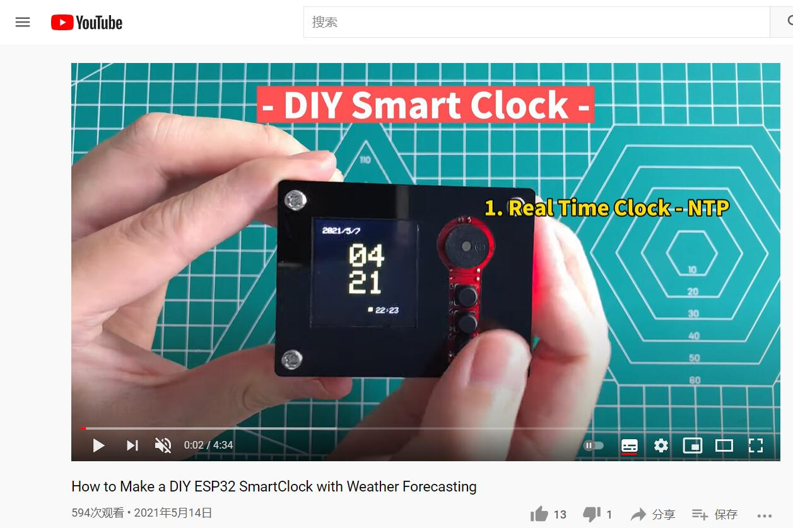

# Makerfabs SmartClock Kit

```c++
/*
Version:        V1.2
Author:            Vincent
Create Date:    2021/4/14
Note:
    2023/5/12 V1.2:Change Weather API.
    2021/5/27 V1.1:Add product link and picture.

*/
```


[TOC]

# Makerfabs

[Makerfabs home page](https://www.makerfabs.com/)

[Makerfabs Wiki](https://wiki.makerfabs.com/)

# Makerfabs SmartClock Kit

​    It is a kit for starters. After 1~2 hours soldering and assembly, and easy steps to set the WiFi ssid and password by a phone, you will get: 

1. An real-time clock, it will get the world real-time from the Network timing protocol, you can set your local time zone easily 
2. An Alarm clock, with loud noise 
3. An Online world weather forecaster, about the local temperature/weather, you can easily change/alter your address/cities without any re-programming

## Intruduce

Product Link ：[DIY ESP32 SmartClock Kit with Weather Forecasting](https://www.makerfabs.com/diy-esp32-smartclock-kit.html) 

Wiki Link :  [No wiki]() 

Instruction Book : [DIY ESP32 Smart Clock Guide](https://www.makerfabs.com/desfile/files/DIY-ESP32-SmartClock-Guide-V1-5.pdf) 

## Feature

- ESP32 WROOM module: WiFi, Bluetooth, 4MB Flash
- 1.44inch 128*128 color display, ST7735 driver*
- Micro USB interface
- Support Arduino
- 450mAh battery, support charge
- Plug-in components, easy soldering

### Part List

- ESP32 SmartClock Kit Mainboard
- Batch of Capacitors& Resistors/Connectors
- Colorful LCD Module
- Lipo Battery
- Acrylic Boards
- Nuts & screws


# Firmware

## Equipment list

- SmartClock Kit
- Soldering iron

## Compiler Options

**If you have any questions，such as how to install the development board, how to download the code, how to install the library. Please refer to :[Makerfabs_FAQ](https://github.com/Makerfabs/Makerfabs_FAQ)**

- Install board : ESP32 .

- Install library : Adafruit_GFX library.

- Install library : Adafruit_ST7735 library.

- Install library : ArduinoJson library.

- Upload codes, select "ESP32 Dev Module" and "Huge APP"

## How To Use

[How to Make a DIY ESP32 SmartClock with Weather Forecasting](https://www.youtube.com/watch?v=e5g6aSs4Ocg&t=6s)


